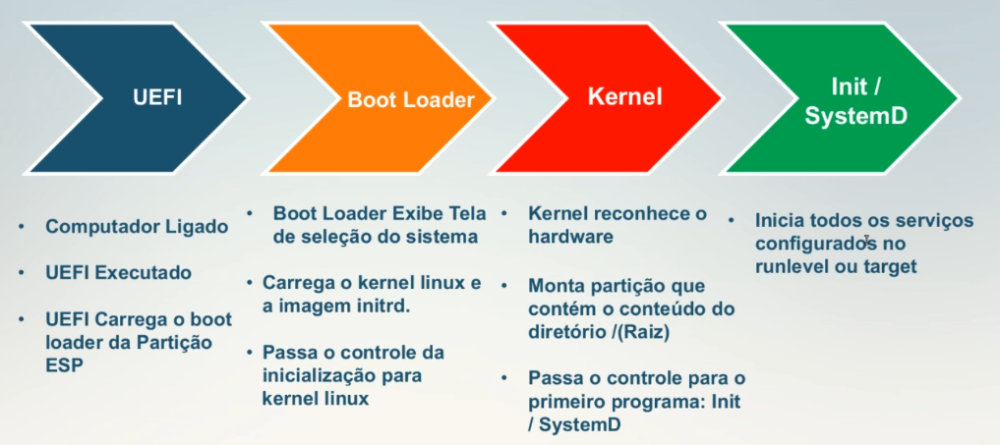

# 101.2 Início (boot) do sistema

## 1. O Processo de Inicialização (Boot)
Quando você aperta o botão de ligar o computador, vários componentes trabalham em sequência até que você veja a tela de login. A ordem geral é:

1. Liga o computador `↓`
2. BIOS ou UEFI `↓`
3. Bootloader (GRUB) `↓`
4. Kernel Linux `↓`
5. initramfs *(quando necessário)* `↓`
6. systemd (PID 1) `↓`
7. Serviços do sistema `↓`
8. Login (terminal ou interface gráfica)

## 2. BIOS x UEFI
### BIOS (Legacy BIOS)
A BIOS é o firmware tradicional presente em computadores mais antigos. Quando o computador liga, ela executa os seguintes passos:
1. Executa o **POST** (Power-On Self Test).
2. Detecta CPU, memória, teclado e discos.
3. Procura um dispositivo de boot.
4. Lê o primeiro setor do disco (**MBR**).
5. Entrega o controle ao bootloader.

* **Fluxo:** Liga `↓` BIOS `↓` POST `↓` MBR `↓` GRUB `↓` Kernel

#### Limitações da BIOS
A LPIC gosta de cobrar estas características:
* Usa **MBR** (Master boot record)
* Máximo de **2 TB** por disco
* Até **4 partições primárias**
* Interface simples
* Modo de **16 bits**

### UEFI
UEFI é o substituto moderno da BIOS.

* **Fluxo:** Liga `↓` UEFI `↓` EFI System Partition (ESP) `↓` GRUB EFI `↓` Kernel



#### Diferenças importantes:
* Suporta **GPT**
* Discos maiores que **2 TB**
* Muitas partições
* Interface gráfica (em muitos equipamentos)
* **Secure Boot**
* Inicialização mais rápida

### Tabela Comparativa: BIOS x UEFI

| Característica | BIOS | UEFI |
| :--- | :--- | :--- |
| **Esquema de Partição** | Usa MBR | Usa GPT |
| **Limite de Disco** | Limite de 2 TB | Muito maior |
| **Partições** | Até 4 partições primárias | Muitas partições |
| **Modo de Operação** | Código de 16 bits | 32 ou 64 bits |
| **Modernidade** | Firmware antigo | Firmware moderno |
| **Local do Boot** | Boot pelo MBR | Boot pela ESP |

---
## Etapas
### BIOS/UEFI
São responsáveis por:
* Detectar hardware
* Inicializar CPU e memória
* Detectar discos
* Escolher o dispositivo de boot

*Depois disso, o firmware praticamente deixa de participar.*

### Bootloader
Na maioria das distribuições Linux, o bootloader padrão é o **GRUB**. Ele é responsável por:
* Mostrar o menu de boot
* Escolher e carregar o kernel
* Carregar o initramfs

### Kernel
Quando começa a executar, o kernel:
* Detecta hardware e inicializa drivers
* Monta o sistema de arquivos inicial
* Inicializa a memória
* Inicia o primeiro processo do sistema
* O Kernel executa o diretório `/sbin/init` com PID 1  
### initramfs
É um pequeno sistema de arquivos temporário carregado na memória RAM. Ele existe para permitir que o kernel carregue os módulos necessários antes de acessar o sistema de arquivos principal.

* **Exemplo:** Kernel `↓` initramfs `↓` carrega driver NVMe `↓` monta `/`

*Sem ele, alguns discos poderiam nem ser reconhecidos durante a inicialização.*

### systemd
Depois que o kernel termina sua parte, ele inicia o primeiro processo do espaço de usuário: o **PID 1**. Na maioria das distribuições atuais, esse processo é o **systemd**. Ele inicia:
* Rede e SSH
* Interface gráfica
* Cron e Banco de dados
* Demais serviços do sistema

---

## 4. Parâmetros do Kernel
É possível passar opções para o kernel no momento da inicialização, com propósitos que vão desde especificar o montante de memória até entrar no modo de manutenção do sistema  
Antes de carregar o kernel, o bootloader (geralmente o grub) apresenta um prompt que normalmente exibe a lista de kernel instalados e disponíveis para carregamento. Para passar argumentos ao kernel é necessário escolher a linha que inicial pelo termo kernel ou nas versões mais atuais do grub linux, e apertar a tecla [e].

* **Exemplo no GRUB:**
  ```text
  linux /boot/vmlinuz root=/dev/sda2 ro quiet
  ```

Os parâmetros aparecem no final da linha do kernel:

* `root=`: Indica onde está a partiçao raiz. *(Ex: `root=/dev/sda2` ou `root=UUID=xxxx`)*
* `ro`: Monta inicialmente o sistema de arquivos como **somente leitura** (Read-Only). Depois o sistema o remonta como leitura e escrita. Muito comum.
* `rw`: Já monta a raiz diretamente em **leitura e escrita**.
* `quiet`: Reduz as mensagens mostradas durante o boot (oculta logs como *loading... checking...* mostrando apenas a tela da distribuição).
* `splash`: Mostra a animação gráfica da distribuição (Ex: tela de carregamento do Ubuntu).
* `single`: Inicializa em modo de usuário único (*single-user mode*), normalmente usado para manutenção. Em sistemas com systemd, também é comum usar `systemd.unit=rescue.target`.
* `init=`: Permite especificar qual programa será iniciado como PID 1. *(Ex: `init=/bin/bash`, muito utilizado para recuperação do sistema)*

---

## 5. dmesg
O comando `dmesg` mostra as mensagens produzidas pelo **kernel**, lendo o seu buffer de mensagens.

```bash
# Exemplo de saída:
CPU detected
USB device connected
SATA initialized
Kernel version...
Memory available...
```

### Comandos úteis com dmesg:
* `dmesg -T`: Mostra os horários em formato legível.
* `dmesg | grep USB`: Procura por mensagens relacionadas a dispositivos USB.
* `dmesg | grep SATA`: Procura por mensagens de discos SATA.
* `dmesg | grep error`: Filtra por erros do kernel.

---

## 6. journalctl
Em sistemas com systemd, os logs são armazenados de forma binária no **journal**. Para consultá-los, usamos o comando `journalctl`.

* `journalctl`: Exibe todos os logs do sistema (kernel, serviços e aplicações).
* `journalctl -k`: Mostra **apenas mensagens do kernel**. É semelhante ao `dmesg`, mas consulta o journal em vez do buffer atual da RAM.
* `journalctl -b`: Mostra apenas as mensagens desde a **inicialização atual**.
* `journalctl -b -1`: Mostra os logs do **boot anterior** (essencial se o sistema falhou na última inicialização).
* `journalctl -f`: Segue os logs em tempo real (funciona de forma parecida com o `tail -f`).

---

## 7. Tabela Comparativa: dmesg x journalctl

| Critério | dmesg | journalctl |
| :--- | :--- | :--- |
| **Origem** | Mostra mensagens do kernel | Mostra logs gerais do sistema |
| **Leitura** | Lê o buffer do kernel (RAM) | Lê o journal do systemd (Disco/RAM) |
| **Foco** | Hardware e inicialização precoce | Kernel, serviços e aplicações |
| **Uso Ideal** | Diagnosticar detecção de hardware | Investigar falhas durante ou após o boot |

## 8. Diretórios e arquivos de logs importantes  


| Caminho do Arquivo / Pasta | Tipo de Informação Armazenada | Uso Principal na LPIC-1 |
| :--- | :--- | :--- |
| **`/var/log/boot.log`** | Registro da inicialização do sistema. | Validar quais serviços iniciaram com sucesso ou falharam durante o boot. |
| **`/var/log/messages`** ou **`/var/log/syslog`** | Logs gerais do sistema e serviços comuns. | Arquivo principal de consulta para mensagens que não possuem um log próprio (Debian/Ubuntu usam `syslog`; RHEL/CentOS usam `messages`). |
| **`/var/log/dmesg`** | Registro estático do buffer do kernel no boot. | Salva as mensagens de detecção de hardware geradas logo na inicialização. |
| **`/var/log/auth.log`** ou **`/var/log/secure`** | Logs de segurança e autenticação. | Registrar logins de usuários, tentativas de conexões SSH e uso do comando `sudo`. |
| **`/var/log/journal/`** | Repositório binário do `systemd-journald`. | Pasta onde o `journalctl` armazena os logs de forma persistente no disco. |


## Pegadinhas Comuns da LPIC-1

* **Quem carrega o kernel?**
  * **Resposta:** O bootloader (geralmente o GRUB), **não** a BIOS/UEFI.
* **Quem inicia os serviços do sistema?**
  * **Resposta:** O systemd (ou outro sistema de init), **não** o kernel.
* **Qual comando mostra apenas as mensagens do kernel?**
  * **Resposta:** `dmesg`. Em sistemas com systemd, `journalctl -k` também exibe as mensagens do kernel registradas no journal.
* **Qual comando mostra os logs do boot anterior?**
  * **Resposta:** `journalctl -b -1`.
* **Onde a UEFI procura o bootloader?**
  * **Resposta:** Na **EFI System Partition (ESP)**.
* **Qual é a ordem correta do processo de inicialização?**
  * **Resposta:** Firmware (BIOS/UEFI) `→` Bootloader (GRUB) `→` Kernel `→` initramfs `→` systemd (PID 1) `→` Serviços `→` Login.

## Exercícios

### Questão 1 (Múltipla Escolha)
Durante o processo de boot em um sistema x86_64 que utiliza BIOS tradicional, qual é o componente responsável por localizar, carregar na memória e passar o controle para o primeiro estágio do gerenciador de inicialização (como o GRUB)?  

* [ ] A) O Kernel Linux  
* [ ] B) O MBR (Master Boot Record)  
* [ ] C) A partição ESP (EFI System Partition)  
* [ ] D) O daemon init ou systemd  
Alternativa:  
B - Em um sistema com BIOS tradicional, a BIOS realiza o POST e lê os primeiro 512 bytes do disco (o MBR). É no MBR que reside o primeiro estágio do bootloader  

### Questão 2 (Preenchimento de Lacuna)
Um administrador precisa visualizar as mensagens enviadas pelo kernel ao buffer de anel (ring buffer) durante o processo de boot atual, filtrando a saída para exibir apenas alertas e erros. Complete o comando abaixo com a opção correta para definir o nível de criticidade (log level) dos alertas:  

dmesg --level=err,alert______  
O comando dmesg possui o parâmetro --level (ou -l) para filtrar mensagens do ring buffer por serveridade 

### Questão 3 (Múltipla Escolha)  
Você está dando manutenção em um servidor moderno que utiliza UEFI em vez de BIOS. Onde o firmware UEFI busca os arquivos binários (.efi) do gerenciador de boot para iniciar o sistema operacional?  

* [ ] A) Nos primeiros 446 bytes do disco rígido principal (MBR).  
* [ ] B) Em uma partição formatada obrigatoriamente como NTFS ou ext4.  
* [ ] C) Em uma partição formatada em FAT (geralmente FAT32), conhecida como ESP.  
* [ ] D) Diretamente na memória ROM da placa-mãe.  
Alternativa:  
C - A partição ESP é obrigatóriamente formatada em variações de FAT32, FAT12 ou FAT16, para que o firmware UEFI consiga ler seus arquivos nativamente  
---

### Questão 4 (Preenchimento de Lacuna)
Qual é o caminho absoluto do diretório padrão em sistemas modernos baseados em UEFI onde o firmware armazena as variáveis de boot e arquivos de inicialização (ponto de montagem da partição EFI)?  

___/boot/efi______________

### Questão 5 (Múltipla Escolha)
Um analista de suporte deseja alterar temporariamente os parâmetros de inicialização do kernel a partir do menu do GRUB2 para fazer uma manutenção. Ele quer que o sistema inicialize diretamente em um shell root local, sem carregar os scripts e serviços normais do sistema. Qual parâmetro deve ser adicionado ao final da linha do kernel?

* [ ] A) systemd.unit=rescue.target  
* [ ] B) init=/bin/bash  
* [ ] C) single=true  
* [ ] D) boot.mode=safemode  
Alternativa:
B - init=/bin/bash instrui o kernel a ignorar o sistema de inicialização padrão (como o systemd) e abrir diretamente o shell Bash com privilégios de root.     

### Questão 6 (Preenchimento de Lacuna)
Se você deseja utilizar o comando journalctl para inspecionar especificamente as mensagens de log correspondentes apenas ao boot anterior (e não ao atual), qual opção/parâmetro deve ser fornecido ao comando?

journalctl _-b -1_____  
A opção -b (ou --boot) serve para filtrar por inicializações. O parâmetro 0 foca no boot atual, -1 foca no boot imediatamente anterior  

### Questão 7 (Múltipla Escolha)
Considere a sequência típica de inicialização de um sistema Linux. Qual das seguintes alternativas apresenta a ordem cronológica correta dos eventos, do momento em que o botão de ligar é pressionado até a tela de login?

* [ ] A) GRUB -> Kernel -> BIOS/UEFI -> init/systemd
* [ ] B) BIOS/UEFI -> Kernel -> GRUB -> init/systemd
* [ ] C) BIOS/UEFI -> GRUB -> Kernel -> init/systemd
* [ ] D) Kernel -> BIOS/UEFI -> GRUB -> init/systemd  
Alternativa:  
C  

### Questão 8 (Múltipla Escolha)
Durante a inicialização do kernel, o arquivo inicial do sistema de arquivos em memória (initramfs) é carregado. Qual é o propósito primordial do initramfs ou initrd nesse estágio do boot?

* [ ] A) Verificar a integridade de todas as partições do usuário usando fsck.
* [ ] B) Fornecer os drivers e módulos necessários para que o kernel possa montar o sistema de arquivos raiz (/).
* [ ] C) Iniciar a interface gráfica do usuário (X11 ou Wayland).
* [ ] D) Atualizar o firmware da BIOS ou UEFI automaticamente.
Alternativa:  
B - Se o seu disco rígido precisa de um driver RAID, SCSI ou de um sistema de arquivos específico (como ext4/xfs) que não está embutido diretamente no binário do kernel, o initramfs (que roda temporariamente na RAM) providencia esses módulos para que o kernel consiga enxergar e montar o /  

### Questão 9 (Preenchimento de Lacuna)
Escreva o nome do comando que permite limpar (esvaziar visualmente) o buffer de mensagens do kernel (ring buffer) após a leitura, exigindo privilégios de superusuário para tal ação:

___dmesg_ -c


### Questão 10 (Múltipla Escolha)
Um administrador de sistemas adicionou o parâmetro quiet à linha de comando do kernel no arquivo de configuração do GRUB. Qual será o efeito prático desse parâmetro durante o próximo boot?

* [ ] A) O kernel desativará completamente a geração de logs no syslog e no journald.
* [ ] B) O sistema inicializará sem emitir nenhum bipe sonoro (beep) da placa-mãe.
* [ ] C) A maior parte das mensagens informativas do kernel não será exibida na tela durante o boot.
* [ ] D) O kernel limitará o uso de CPU para reduzir o ruído das ventoinhas do servidor.
Alternativa:  
C - O parâmetro quiet (silencioso) serve exatamente para esconder a cascata de textos do kernel na tela preta enquanto o sistema liga, deixando o boot visualmente mais limpo   

### Questão 11 (Múltipla Escolha)
A prova LPIC-1 costuma cobrar a diferença entre implementações de logs. Se um sistema Linux configurou o systemd-journald de forma estritamente volátil (padrão em algumas distribuições), onde as mensagens do journalctl coletadas desde o boot atual ficam armazenadas?

* [ ] A) /var/log/journal/
* [ ] B) /run/log/journal/
* [ ] C) /etc/systemd/journal/
* [ ] D) /boot/journal/
Alternativa:  
B - Se o journald for configurado como volátil, ele armazena os dados estritamente na memória RAM. No ecossistema Linux, o diretório /run/ é um sistema de arquivos em memória (tmpfs). Arquivos persistentes ficam em /var/log/journal/, mas se o enunciado especificou "estritamente volátil", o destino correto é /run/log/journal/  

### Questão 12 (Preenchimento de Lacuna)
Insira o parâmetro do kernel que força o sistema a inicializar em modo monousuário (Single User Mode) tradicional no SysVinit ou alvos equivalentes no systemd:

___single_______


### Questão 13 (Múltipla Escolha)
Ao analisar o comportamento de um servidor que apresentou travamentos na inicialização, você executa o comando dmesg. De onde exatamente esse comando extrai as informações exibidas na tela?

* [ ] A) Do arquivo texto /var/log/messages.
* [ ] B) Da memória RAM, lendo o buffer circular mantido pelo kernel.
* [ ] C) Do diretório /proc/sys/kernel/.
* [ ] D) Diretamente do setor de boot do disco rígido.
Alternativa:  
B - O /proc/sys/kernel/ armazena configurações dinâmicas de comportamento do kernel, e não o log de mensagens. O comando dmesg lê diretamente do ring buffer (buffer circular) que fica alocado na memória RAM gerenciada pelo kernel.  

### Questão 14 (Preenchimento de Lacuna)
Para visualizar apenas as últimas 20 linhas de mensagens geradas pelo kernel em tempo real conforme elas acontecem (modo "follow"), qual combinação de opções do comando dmesg deve ser usada? Complete a lacuna:

dmesg __-w____

### Questão 15 (Múltipla Escolha)
Qual das seguintes características descreve uma vantagem exclusiva do processo de boot via UEFI quando comparado à BIOS tradicional?

* [ ] A) Suporte exclusivo a sistemas operacionais de 32 bits.
* [ ] B) Capacidade de inicializar a partir de discos maiores que 2 TB usando a tabela de partições GPT.
* [ ] C) Dependência obrigatória do código localizado no setor MBR.
* [ ] D) Inicialização mais rápida devido à ausência total de verificação de hardware (POST).
Alternativa:  
B - A BIOS tradicional é limitada ao MBR, que só gerencia partições de até 2 TB e no máximo 4 partições primárias. A UEFI quebra essa barreira ao trabalhar nativamente com o esquema GPT (GUID Partition Table), suportando discos imensos e muito mais partições.

