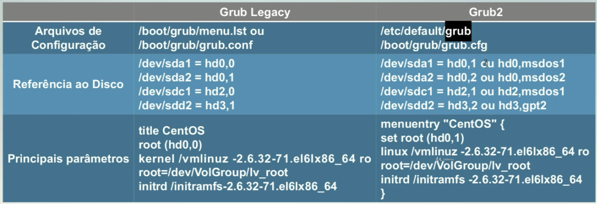

# Tópico 102.2: Instalar o gerenciador de inicialização

---

## 1. O processo de boot   

1. **Firmware (BIOS ou UEFI)** — faz o POST (Power-On Self-Test) e localiza um dispositivo de boot.
2. **Boot loader (estágio 1)** — código pequeno gravado no **MBR** (512 bytes) ou carregado pela **UEFI** a partir da **EFI System Partition (ESP)**. Sua única função é carregar o restante do boot loader.
3. **Boot loader (estágio 2)** — o boot loader completo (GRUB, por exemplo) é carregado, lê seu arquivo de configuração e apresenta um menu ao usuário.
4. **Kernel** — o boot loader carrega o kernel Linux e, geralmente, uma imagem **initramfs/initrd** (sistema de arquivos temporário com módulos e drivers necessários para montar o `/` real).
5. **init/systemd** — o kernel executa o primeiro processo (PID 1), que inicializa o restante do sistema.

### BIOS + MBR vs. UEFI + GPT

| Característica | BIOS legado | UEFI |
|---|---|---|
| Tabela de partição | MBR (máx. 4 partições primárias, discos até ~2 TB) | GPT (até 128 partições, discos > 2 TB) |
| Onde fica o boot loader | Primeiros 512 bytes do disco (MBR) + "boot loader gap" | Partição dedicada, **EFI System Partition** (ESP), formatada em FAT32, montada em `/boot/efi` |
| Arquivo executado | Código binário no MBR (`stage 1`) | Arquivo `.efi` (ex.: `grubx64.efi`) dentro da ESP |
| Gerenciamento de entradas | Configuração interna do boot loader | Firmware mantém uma NVRAM com entradas de boot, gerenciável via `efibootmgr` |

```bash
                    COMPUTADOR
                        │
                        ▼
                 Firmware UEFI
                        │
                        │ procura no disco
                        ▼
              ┌───────────────────┐
              │       DISCO       │
              │       /dev/sda    │
              │                   │
              │   GPT / MBR       │
              │   ├─ Partição 1   │
              │   │   ESP (FAT32) │
              │   │               │
              │   ├─ Partição 2   │
              │   │   Linux /     │
              │   │   ext4        │
              │   └─ ...          │
              └───────────────────┘
                        │
                        ▼
             ESP -> (EFI System Partition)
                        │
                        ├── EFI/
                        │    └── debian/
                        │         └── grubx64.efi
                        ▼
                   Bootloader
                     (GRUB)
                        │
                        ▼
                   Kernel Linux
                        │
                        ▼
              Gerenciador de serviços
                     (PID 1)
                    - SystemD (systemctl)
                    - SysVinit (service)
                    - Upstar (start, stop, restart)

# GPT esquema de particionamento  
# ESP é uma partição usada pelo UEFI para armazenar os carregadores `.efi`
# O GRUB é o bootloader (carregador de inicialização)
```

> ESP (EFI System Partition) em montada em: `/boot/efi`, já o MBR não é montada em nenhum diretório. O MBR é acessado pelo BootLoader durante o processo de inicialização  

---

## 2. GRUB Legacy  

> [!NOTE]  
> GRUB: é o gerenciador de inicialização padrão da maioria das distribuições linux. Ele serve como uma ponte entre o hardware (BIOS/UEFI) e o sistema operacional  

Praticamente extinto na prática, mas ainda pode aparecer na prova como conceito histórico.

- Arquivo de configuração: **`/boot/grub/menu.lst`** (em algumas distros, `grub.conf`).
- Estrutura básica de uma entrada:

```
default 0
timeout 5

title Debian GNU/Linux
    root (hd0,0)
    kernel /boot/vmlinuz root=/dev/sda1 ro
    initrd /boot/initrd.img
```

- Numeração de discos e partições é **baseada em zero** e usa a notação `(hdX,Y)`: `hd0` = primeiro disco, `,0` = primeira partição.
- Instalação do estágio 1 no MBR:

```bash
grub-install /dev/sda
```

- Modo interativo do shell do GRUB Legacy (`grub>`) permitia comandos como `root`, `kernel`, `initrd`, `boot` digitados manualmente — útil para recuperação de sistema.

---

## 3. GRUB 2 — o padrão atual

GRUB 2 é o boot loader usado por praticamente todas as distribuições modernas (Debian/Ubuntu, RHEL/Fedora, openSUSE, etc.) e é o foco principal da prova hoje.

### 3.1 Arquivos e diretórios importantes

| Caminho | Função |
|---|---|
| `/boot/grub/grub.cfg` (ou `/boot/grub2/grub.cfg` em RHEL-like) | Arquivo de configuração **gerado automaticamente** — nunca editar diretamente |
| `/etc/default/grub` | Arquivo onde o **usuário** define as opções (timeout, kernel padrão, parâmetros do kernel) |
| `/etc/grub.d/` | Scripts executáveis que geram trechos do `grub.cfg` (ex.: `10_linux`, `30_os-prober`) |
| `/boot/efi/EFI/<distro>/grubx64.efi` | Binário do GRUB em sistemas UEFI, dentro da ESP |

### 3.2 Fluxo de configuração   

1. Editar `/etc/default/grub` (ex.: mudar `GRUB_TIMEOUT`, `GRUB_DEFAULT`, `GRUB_CMDLINE_LINUX`).
2. Regenerar o `grub.cfg`:

```bash
grub-mkconfig -o /boot/grub/grub.cfg
# ou, em Debian/Ubuntu, o wrapper equivalente:
update-grub
```

3. (Re)instalar o boot loader no dispositivo de boot, se necessário:

```bash
grub-install /dev/sda          # BIOS/MBR
grub-install --target=x86_64-efi --efi-directory=/boot/efi   # UEFI
```

### 3.3 Principais variáveis de `/etc/default/grub`

```bash
GRUB_DEFAULT=0                  # entrada padrão do menu (0 = primeira; "saved" = última usada, junto com GRUB_SAVEDEFAULT=true)
GRUB_TIMEOUT=5                  # segundos de exibição do menu antes do boot automático
GRUB_TIMEOUT_STYLE=menu         # menu | countdown | hidden
GRUB_DISTRIBUTOR=`lsb_release -i -s 2>/dev/null || echo Debian`   # nome da distro exibido no menu
GRUB_CMDLINE_LINUX_DEFAULT="quiet splash"   # parâmetros de kernel só para boot normal
GRUB_CMDLINE_LINUX=""           # parâmetros de kernel para TODAS as entradas (inclusive recovery)
GRUB_DISABLE_RECOVERY="true"    # oculta as entradas de modo de recuperação
GRUB_DISABLE_OS_PROBER="false"  # habilita/desabilita a detecção de outros SOs (ex: Windows) via os-prober
GRUB_TERMINAL="console"         # força uso do terminal em modo texto (útil em servidores/VMs)
GRUB_GFXMODE=1920x1080          # resolução do menu gráfico do GRUB
```
Alterações realizadas na instância Ubuntu do Notebook LG:
```bash
  6 # Default -> irá definir o sistema padrao que sera carregado
  7 GRUB_DEFAULT=0
  8
  9 # Define o modo de exibicao visual do menu do GRUB.
 10 # O valor "hidden" esconde o muno de escolha. O valor "menu" exibe o menu pre inicializacao do SO
 11 GRUB_TIMEOUT_STYLE=menu
 12
 13 # Determina o tempo de espera antes de iniciar o sistema
 14 GRUB_TIMEOUT=5
 15
 16 # Identifica o nome da distribuicao Linux atual
 17 GRUB_DISTRIBUTOR=`( . /etc/os-release; echo ${NAME:-Ubuntu} ) 2>/dev/null || echo Ubuntu`
 18
 19 # Nesse parametro e possivel passar valores e comandos extras para o kernel
 20 GRUB_CMDLINE_LINUX_DEFAULT=""
 21
 22 # Nesse parametro e possivel passar valores e comandos globais para a inicializacao do sistema
 23 GRUB_CMDLINE_LINUX=""
```

`/etc/default/grub` é o principal arquivo de configuração do GRUB que pode (e deve) ser editado manualmente. Ele **não é lido diretamente pelo GRUB no boot** — serve apenas como entrada para os scripts de `/etc/grub.d/`, que geram o arquivo final.

> ⚠️ Depois de editar `/etc/default/grub`, as mudanças **não são aplicadas automaticamente**. É necessário regenerar o arquivo de configuração de boot.

Para regenerar o `grub.cfg`:

```bash
# Debian/Ubuntu (wrapper mais simples)
sudo update-grub

# Comando genérico, disponível em qualquer distro (cobrado no LPI)
sudo grub-mkconfig -o /boot/grub/grub.cfg

# RHEL/Fedora/CentOS (binário renomeado para evitar conflito com GRUB legado)
sudo grub2-mkconfig -o /boot/grub2/grub.cfg
```

O GRUB lê o resultado gerado em `/boot/grub/grub.cfg` (ou `/boot/grub2/grub.cfg`) no próximo boot. **Nunca edite esse arquivo diretamente** — qualquer alteração manual é sobrescrita na próxima regeneração (ex: após atualização de kernel).

### 3.4 Interagindo com o GRUB 2 em tempo de boot

- **Tela de menu**: setas para navegar, `Enter` para iniciar.
- **`e`**: editar temporariamente uma entrada antes de iniciar (ex.: adicionar `single` ou `init=/bin/bash` para entrar em modo de recuperação).
- **`c`**: abrir o **console/shell do GRUB** (`grub>`), permitindo comandos manuais como:

```
grub> ls # Lista os dispositivos conectados (ex: hd0,gpt1)  
grub> ls (0hd,gpt1)/boot # lista arquivos dentro de uma partição
grub> set root=(hd0,1)
grub> linux /vmlinuz root=/dev/sda1
grub> initrd /initrd.img
grub> boot
```

Esse shell é essencial para recuperar um sistema quando o `grub.cfg` está corrompido ou ausente.

### Diferenças entre o Grub2 e o Grub Legacy  


- No Grub2, é necessário editar o arquivo `/etc/default/grub` e depois rodar o comando `update-grub` para aplicar as alterações no `/boot/grub/grub.cfg`. No Grub Legacy, o arquivo `/boot/grub/grub` é editado manualmente  

### 3.5 Comandos administrativos úteis

| Comando | Uso |
|---|---|
| `grub-install <disco>` | Grava o boot loader no MBR/ESP |
| `grub-mkconfig` / `update-grub` | Regera o `grub.cfg` a partir de `/etc/default/grub` e `/etc/grub.d/` |
| `grub-mkconfig -o <arquivo>` | Gera a configuração em um caminho específico |
| `update-grub2` (alias em algumas distros) | Idem `update-grub` |
| `os-prober` | Detecta outros sistemas operacionais para dual-boot |
| `dpkg-reconfigure grub-pc` | Em Debian/Ubuntu, reconfigura interativamente em quais discos instalar o GRUB |

Ex:
```bash
grub-install /dev/sda # Comando do Grub 2 responsável por escrever o código do carregador de inicialização no MBR (ou na partição EFI, no caso de UEFI) e instalar os módulos necessários em /boot/grub  
```
---

## 4. UEFI e gerenciamento de entradas de boot

Em sistemas UEFI, além do GRUB propriamente dito, existe a gestão das **entradas de boot na NVRAM do firmware**, feita com:

```bash
efibootmgr -v                     # lista as entradas de boot
efibootmgr -o 0001,0000           # define a ordem de boot
efibootmgr -c -d /dev/sda -p 1 -L "Debian" -l '\EFI\debian\grubx64.efi'  # cria entrada
```

- `-c`: cria nova entrada
- `-d`: disco
- `-p`: número da partição (ESP)
- `-L`: rótulo (label) exibido no menu do firmware
- `-l`: caminho do arquivo `.efi` dentro da ESP

---

## 5. LILO (LInux LOader) — conteúdo histórico

O LPI removeu LILO como exigência central há anos, mas ele ainda aparece nos "termos e utilitários" do objetivo. Vale conhecer o essencial:

- Arquivo de configuração: **`/etc/lilo.conf`**.
- Diferente do GRUB, o LILO **não lê o sistema de arquivos em tempo de boot** — ele grava um mapa de blocos físicos do disco. Por isso, **toda vez que o kernel ou o `lilo.conf` muda, é obrigatório rodar `/sbin/lilo` novamente** para regravar o mapa; esquecer esse passo é a causa clássica de "sistema não bota mais" com LILO.
- Estrutura básica:

```
boot=/dev/sda
default=linux

image=/boot/vmlinuz
    label=linux
    root=/dev/sda1
    read-only
```

- Aplicar a configuração:

```bash
lilo
```

### GRUB vs. LILO (tabela-resumo para prova)

| Aspecto | LILO | GRUB (1/2) |
|---|---|---|
| Lê sistema de arquivos em boot? | Não (usa mapa de blocos) | Sim |
| Precisa re-executar após mudanças? | Sim, sempre `/sbin/lilo` | Só se mudar `grub.cfg`/instalação |
| Suporte a shell interativo | Não | Sim (GRUB) |
| Configuração | `/etc/lilo.conf` | `/etc/default/grub` + `/boot/grub/grub.cfg` |

---

### 6. Resumo rápido para revisão

| Comando/Arquivo | Função |
|---|---|
| `grub-install <dispositivo>` | Instala o GRUB 2 no MBR ou na partição EFI de um dispositivo (ex.: `/dev/sda`) |
| `grub-mkconfig -o /boot/grub/grub.cfg` | Gera o arquivo de configuração do GRUB 2 a partir dos scripts em `/etc/grub.d/` |
| `update-grub` | Atalho (Debian/Ubuntu) que executa `grub-mkconfig -o /boot/grub/grub.cfg` |
| `/boot/grub/grub.cfg` | Arquivo de configuração **gerado automaticamente** pelo GRUB 2 — não deve ser editado manualmente |
| `/etc/default/grub` | Arquivo de configuração **editável** com opções gerais (timeout, kernel padrão, parâmetros de boot) |
| `/etc/grub.d/` | Diretório com scripts numerados usados para montar o `grub.cfg` (ex.: detecção de outros sistemas operacionais) |
| `/boot/grub/menu.lst` | Arquivo de configuração do **GRUB Legacy** (versão antiga, substituído pelo GRUB 2) |
| MBR (*Master Boot Record*) | Esquema de partição BIOS legado; o GRUB é instalado diretamente nos primeiros setores do disco |
| Partição EFI (ESP) | Em sistemas UEFI/GPT, o GRUB é instalado como arquivo `.efi` dentro da partição de sistema EFI |

#### Simulação para recuperação da senha do `root` pelo bootloader  

1. Durante a inicialização do servidor, clique `Esc` repetidamente até entrar no menu do GRUB. 
2. Adicione o seguinte conteúdo `init=/bin/bash` na lina passa os parâmetros para o carregamento do kernel.
Ex: 
    ```bash
    linux /boot/vmlinuz-... root=/dev/sda2 ro quiet init=/bin/  bash
    ```
3. Pressione F10, para que o sistema inicie usando o shell: `/bin/bash` como processo `init`  
4. Altere a senha do root: `passwd root`  

## Exercícios  
**Questão 1**
Durante o **boot**, o sistema apresenta falhas e você precisa inicializar em modo de recuperação (`rescue/single-user mode`) para corrigir um problema crítico. No GRUB 2, qual é o procedimento típico para fazer isso a partir da tela de menu?  

A) Pressionar `e` na entrada de boot desejada, adicionar single (ou 1) ao final da linha do kernel, e pressionar Ctrl+X (ou F10) para inicializar.  
B) Pressionar c para abrir o console e digitar boot rescue.  
C) Selecionar a entrada e pressionar Delete para entrar em modo de recuperação.  
D) Reiniciar o sistema três vezes seguidas para ativar automaticamente o modo de recuperação.  
E) Editar diretamente o arquivo `/boot/grub/grub.cfg` durante o boot, sem usar o menu.  

Alternativa: A
No GRUB 2, pressionar `e` sobre uma entrada do menu abre o editor temporário daquela entrada, permitindo modificar a linha do kernel (linux) para adicionar parâmetros de boot, como single ou 1, que instruem o sistema a inicializar em modo de usuário único (rescue mode).

> [!NOTE]  
> Tecla `e` → edita a entrada de boot temporariamente (nessa opção tem como ediocnar o `rescue mode`)   
> Tecla `c` → abre o shell de comandos do GRUB (útil para digitar comandos manuais quando não há menu configurado,